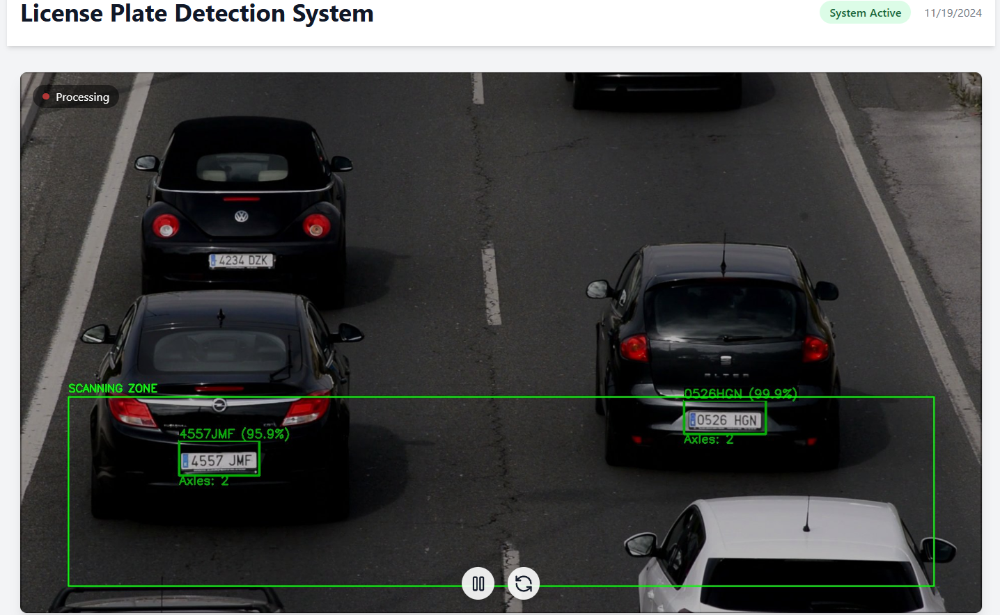
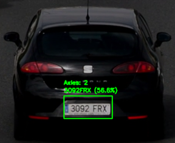
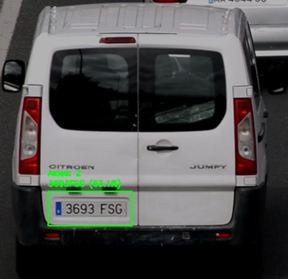
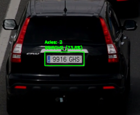
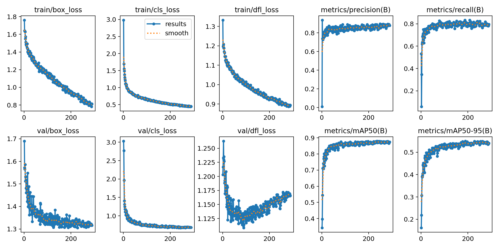
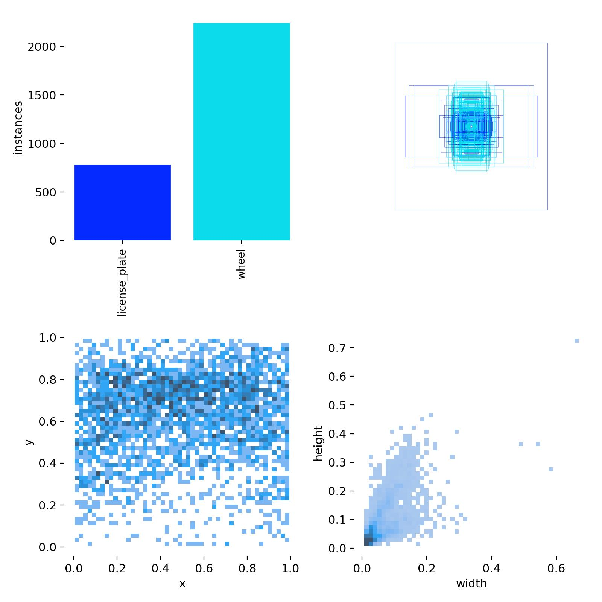
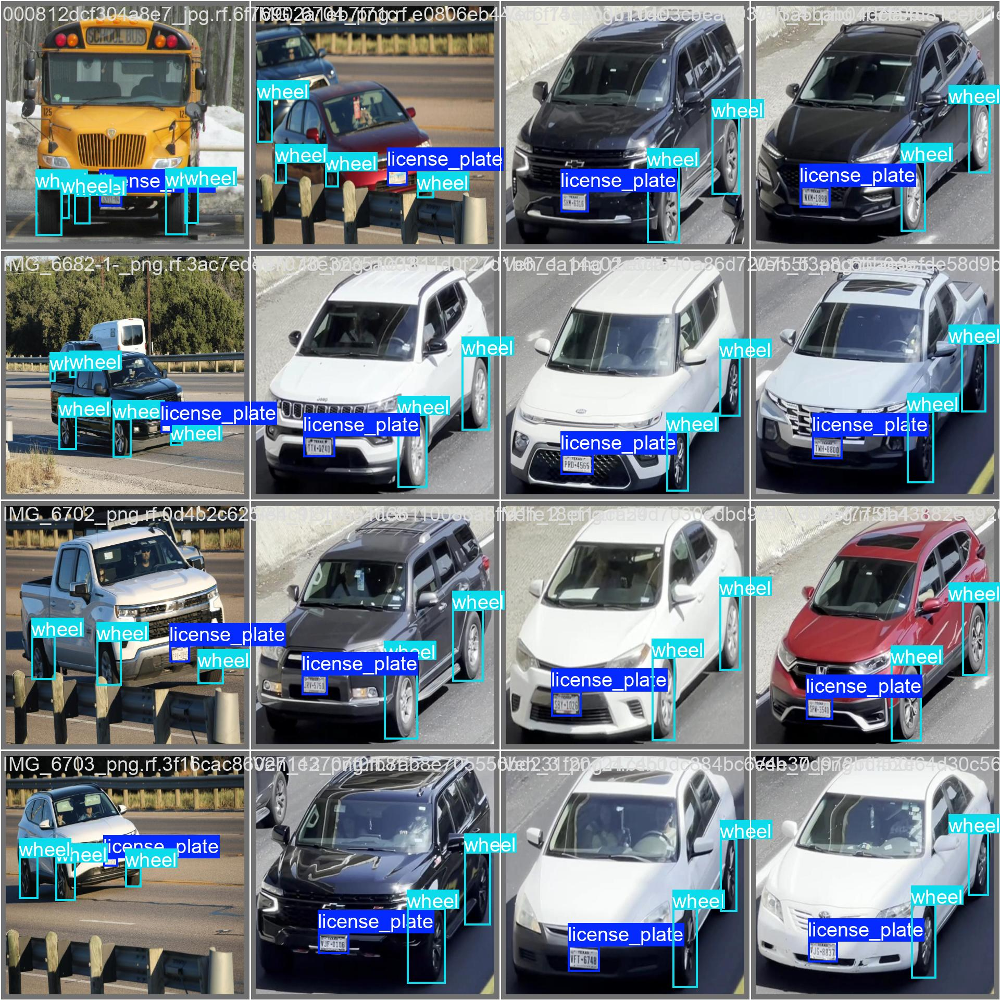

# Tolling ALPR System Computer Vision, OCR ensemble, and Axle counter 🚗

[](https://www.python.org/)
[](https://fastapi.tiangolo.com/)
[](https://pytorch.org/)
[](#)
[](https://opencv.org/)
[](https://github.com/JaidedAI/EasyOCR)
[](https://reactjs.org/)
[](https://www.typescriptlang.org/)
[](https://www.sqlite.org/)
[](https://tailwindcss.com/)

An advanced, real-time vehicle license plate detection and tracking system powered by YOLOv11, computer vision, and ensemble OCR methods. Built with FastAPI, React, and SQLite for efficient end-to-end processing.
<p align="center">
  
  <br>
  <em>ALPR Live Dashboard</em>
</p>
<p align="center">
  
  
  
  <br>
  <em>OCR and Axle counter</em>
</p>


## 🌟 Features

- Real-time license plate detection and tracking
- Advanced OCR using ensemble methods (EasyOCR + Tesseract)
- Automatic vehicle axle counting
- Region of Interest (ROI) management
- Live video feed monitoring
- Searchable plate database
- Real-time statistics dashboard
- Debug image saving for system verification
<p align="center">
  
  
  
  <br>
  <em>Model Training Results</em>
</p>

# 🛠️ Technology Stack

<table>
<tr>
<td width="50%" valign="top">

### Backend & ML
- **Core:**
  - Python 3.8+
  - FastAPI
  - SQLAlchemy
  - SQLite
  
- **Computer Vision:**
  - OpenCV
  - YOLOv11
  - CUDA Toolkit
  - cuDNN

- **Deep Learning:**
  - PyTorch
  - TensorFlow
  - Fast R-CNN
  - RetinaNet
  - EfficientDet
  
- **OCR & Text:**
  - PyTesseract
  - EasyOCR
  - LSTM Networks
  - Attention Models

- **Data & Training:**
  - Roboflow (Dataset Annotation)
  - Weights & Biases
  - MLflow
  - DVC (Data Version Control)

</td>
<td width="50%" valign="top">

### Frontend & DevOps
- **Core:**
  - React 18
  - TypeScript
  - Node.js
  - Vite

- **Styling & UI:**
  - TailwindCSS
  - shadcn/ui components
  - Lucide Icons
  - Radix UI

- **State & Data:**
  - React Query
  - Zustand
  - Axios
  - WebSocket

- **Development:**
  - ESLint
  - Prettier
  - Jest
  - Cypress

</td>
</tr>
</table>

### ML Pipeline Components
- **Data Preparation:**
  - Roboflow for dataset annotation and augmentation
  - Custom data preprocessing pipeline
  - YOLOv11 weight creation and fine-tuning
  
- **Model Architecture:**
  - Backbone: CSPDarknet
  - Neck: PANet with SPP
  - Head: Modified YOLOv11 detection head
  
- **Training & Optimization:**
  - Multi-scale training
  - Mosaic augmentation
  - Adaptive anchor box computation
  - Mixed precision training

- **Inference Pipeline:**
  - TensorRT optimization
  - ONNX Runtime
  - Batch processing
  - Multi-threading optimization
  

## 🎯 Key Components

### Vehicle Detection
- Uses YOLOv11 for real-time vehicle and license plate detection
- Automatic wheel detection for axle counting
- Non-Maximum Suppression (NMS) for overlapping detection removal

### OCR Processing
- Ensemble approach combining EasyOCR and Tesseract
- Advanced image preprocessing pipeline
- Confidence-based result selection
- OCR text cleaning and validation

### Tracking System
- Multi-object tracking with unique track IDs
- Position-based track matching
- Configurable tracking parameters
- State management (TRACKING/LOCKED)

### ROI Management
- Interactive ROI selection
- Intersection calculation
- Visual feedback system
- Debug visualization tools

## 📊 System Architecture

```plaintext
┌─────────────────┐    ┌──────────────┐    ┌───────────────┐
│  Video Source   │────│  YOLOv11     │────│  Tracker      │
│  (Camera/File)  │    │  Detection   │    │  Management   │
└─────────────────┘    └──────────────┘    └───────┬───────┘
                                                   │
                                                   ▼
┌─────────────────┐     ┌──────────────┐     ┌───────────────┐
│  Frontend UI    │ ────│  FastAPI     │ ────│  OCR Engine   │
│  (React)        │     │  Backend     │     │  (Ensemble)   │
└─────────────────┘     └──────────────┘     └───────────────┘
```

## 💾 Database Schema

```sql
CREATE TABLE vehicles (
    id INTEGER PRIMARY KEY,
    track_id INTEGER,
    license_plate VARCHAR(20),
    confidence FLOAT,
    first_seen DATETIME,
    last_seen DATETIME,
    processed BOOLEAN,
    total_detections INTEGER,
    best_frame_path VARCHAR(255)
);
```

## 🔧 Configuration

Key configuration parameters in `config/settings.py`:

```python
OCR_CONFIDENCE_THRESHOLD = 60.0
DETECTION_CONFIDENCE_THRESHOLD = 0.7
ROI_INTERSECTION_THRESHOLD = 0.2
POSITION_THRESHOLD = 50
MAX_TRACK_AGE = 3.0
```

## 🙏 Acknowledgments

- YOLOv11 team for the object detection model
- EasyOCR and Tesseract contributors
- FastAPI and React communities
- All open-source contributors

---

Made with ❤️ by Karthik Sivakoti, Masters in Artificial Intelligence, Department of Computer Science, The Univesity of Texas at Austin
